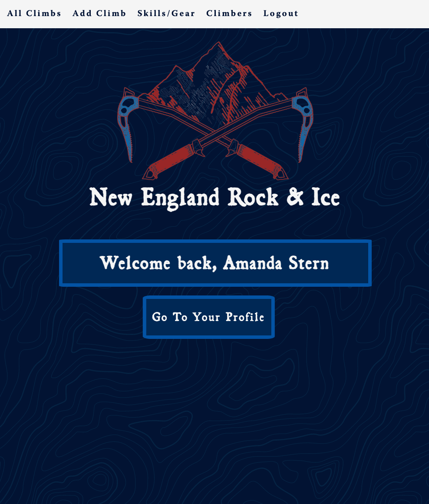
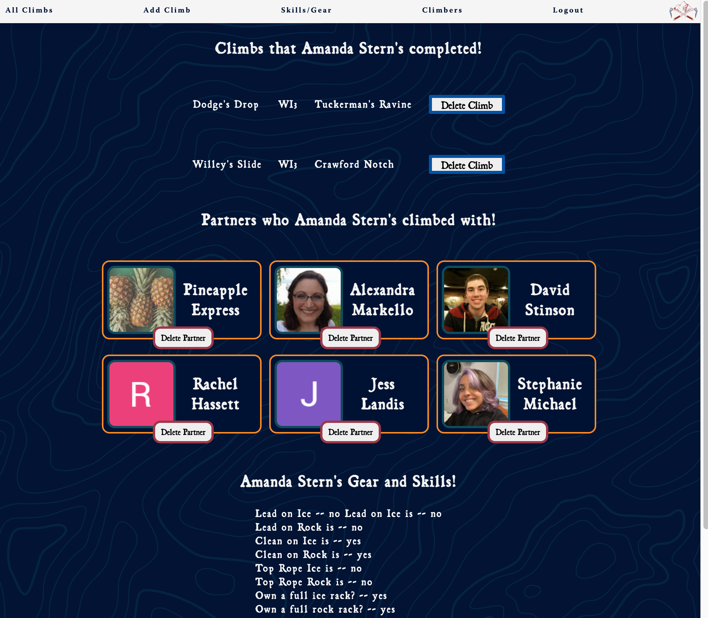
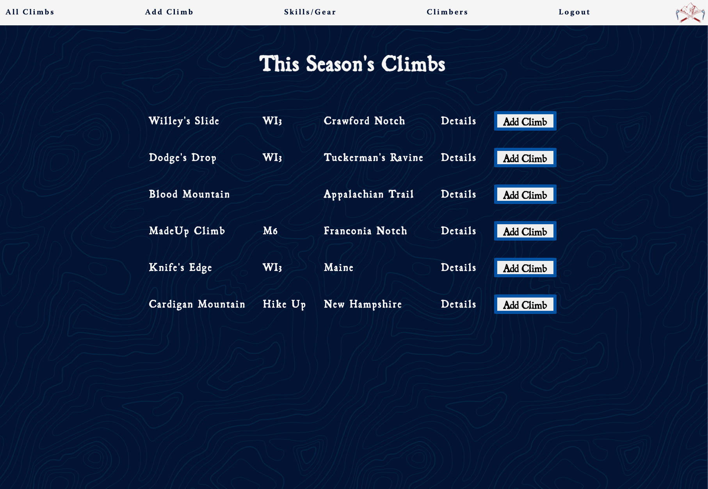
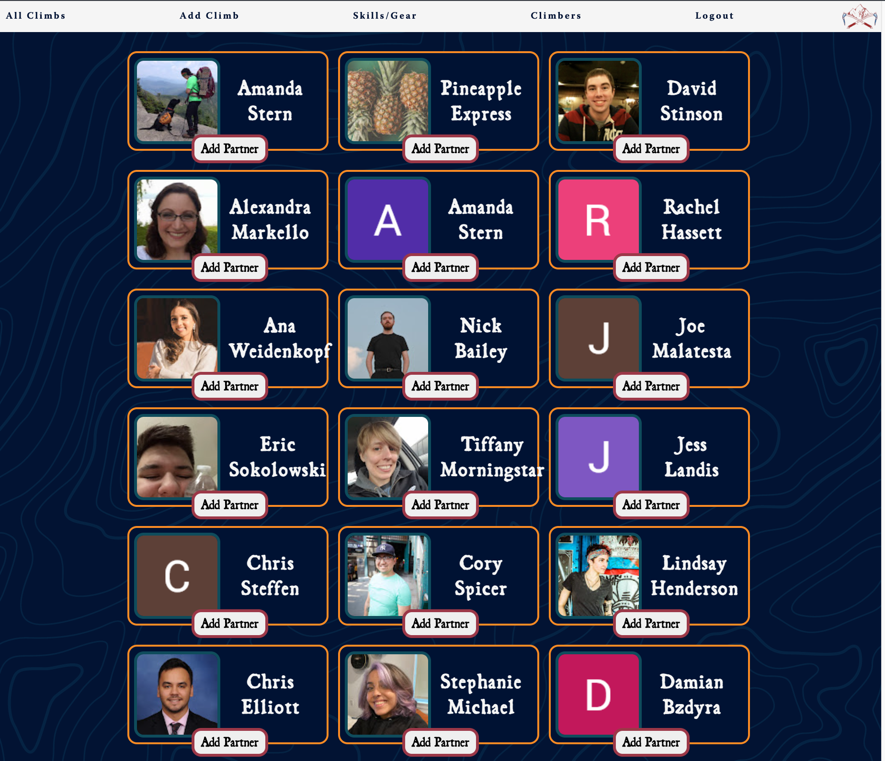
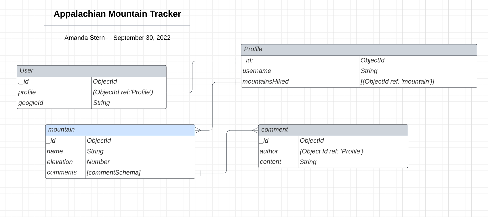

<h1>NEW ENGLAND ROCK & ICE</h1>

<h3>ABOUT THE APP</h3>

<i>
New England Rock and Ice is a climbing database and community for New England's ice and rock climbers. In this app, users can:
<ul>
<li>Create and edit climbs</li>
<li>Add and edit their own reviews on climbs</li> 
<li>Add climbing partners to their profile</li>
<li>Add gear and skills to their profile</li>
<li>delete climbing partners from their profile</li>
</ul>
Additionally, users who created climbs can moderate the comment replies on their climbs with the permissions to delete irrelevant comments/reviews. The app requires a valid Google email address to log in and create a climber profile, as well as to view all the climbs.</i>
 
 
 
LINK TO APP HERE:
 
<a href="https://appalachian-mtns.fly.dev/">NEW ENGLAND ROCK & ICE</a>
 
 

 

 

 

 

<h3>Technologies Used</h3>
<ul>
  <li>MongoDB</li>
  <li>Mongoose</li>
  <li>Google OAuth</li>
  <li>Express JS</li>
  <li>Node JS</li>
  <li>Javascript</li>
  <li>CSS</li>
  <li>HTML</li>
  <li>Adobe Fonts Style Sheets</li>
  <li>VSCode</li>
  <li>Firefox Developer Tools</li>
  <li>Google Chrome Developer Tools</li>
</ul>
 
<h3>Special thanks to the following for engineering and emotional support:</h3>
<ul>
  <li>General Assembly Engineering Channel</li>
  <li>King Manley the Third for his lack of vacation boundaries while in Curacao</li>
  <li>David Stinson for motivating me to be employable</li>
  <li>Hunty for viewing people as errors to solve</li>
  <li>Ian for educating me on the origins of the Hunty term of endearment</li>
  <li>Joe for encouraging me to take breaks despite my protest</li>
  <li>Beryl Baldwin for the extra CSS support & acting skills</li>
  <li>Cory Spicer & Emily D.S. for the encouragement & support</li>
  <li>Jackson, Emily L., Alex - major thanks to the entire GA IA/TA team!</li>
  <li>All of my SEI 8/22 cohort compadres for the feedback and debugging!</li>
</ul>
 
<h3>ICE BOX ITEMS/FUTURE ENHANCEMENTS:</h3>
<ul>
  <li>More CSS styling and animation</li>
  <li>Light/dark mode CSS styling</li>
  <li>More climbing resources</li>
  <li>Improve mobile device usability and display</li>
  <li>Implement Admin functionality</li>
</ul>
 
Please see the following .jpg file to review planning flowchart for building the New England Rock & Ice App

<h2>Planning Materials</h2>
 

 

 